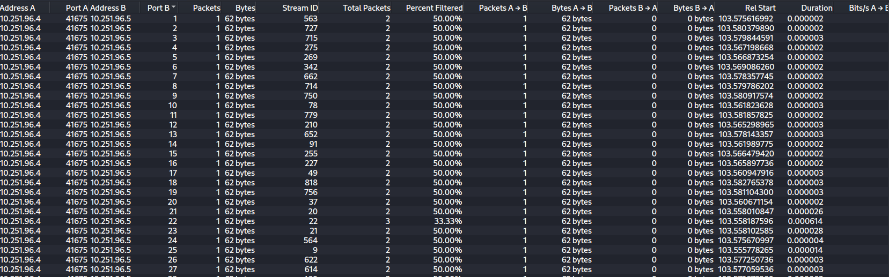
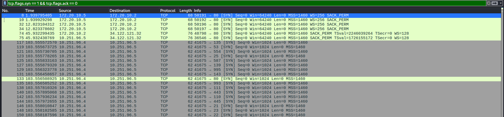
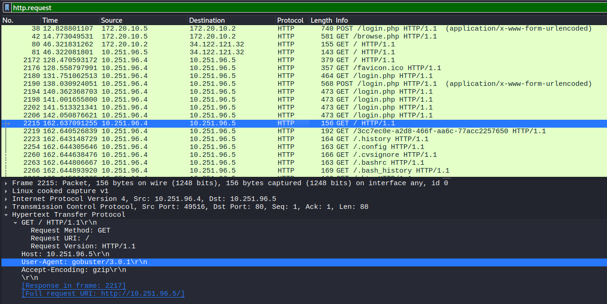
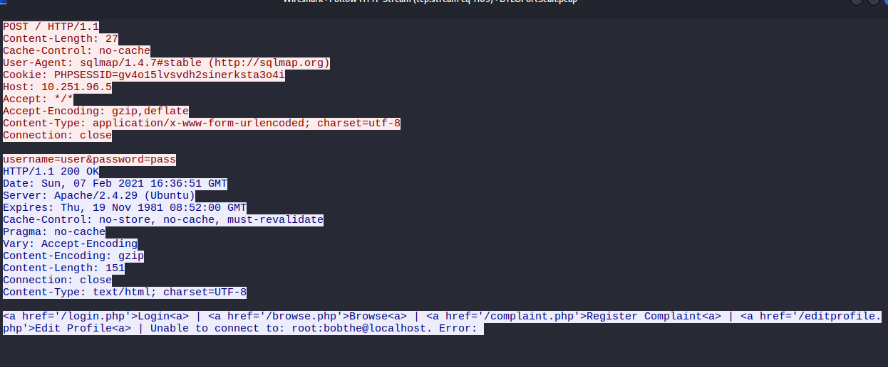
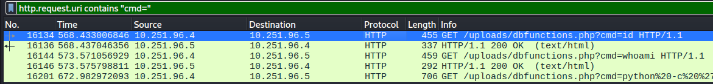
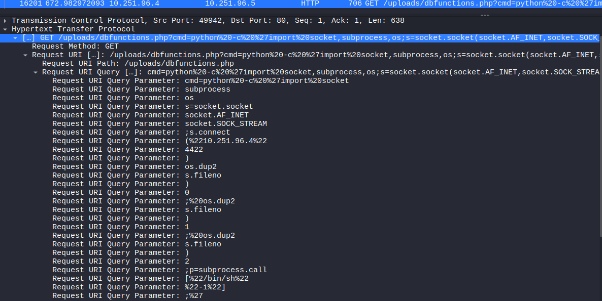

# Network Analysis - Blue Team Labs Online (Write-up)

## Scenario

SOC menerima peringatan di SIEM mereka untuk 'Pemindaian Port Lokal ke Lokal' di mana IP pribadi internal mulai memindai sistem internal lainnya. Dapatkah Anda menyelidiki dan menentukan apakah aktivitas ini berbahaya atau tidak? Anda telah diberikan PCAP, selidiki menggunakan alat apa pun yang Anda inginkan.

## Methodology

File zip diekstrak di VM Kali Linux (snapshot dibuat sebelum mulai),
lalu file `.pcap` dibuka dengan Wireshark. Pendekatannya:
1. Melihat gambaran umum lalu lintas lewat Statistics → Conversations.
2. Mengidentifikasi host yang mencurigakan.
3. Memfilter lalu lintas host itu untuk menentukan tahapan serangan.
4. Mengikuti HTTP Stream untuk melihat isi request dan response.

## Tools

1. Virtual Machine (Kali Linux)
2. Wireshark

**1). IP mana yang bertanggung jawab untuk melakukan aktivitas pemindaian port?**

Pada bagian ini kita ingin mencari IP yang melakukan aktivitas pemindaian port. Langkah yang kita akan kita lakukan di wireshark adalah buka bagian tab **Statistik --> Conversation -->**  setelah masuk di bagian conversation kita bisa klik tab **IPv4** untuk mengurutkan jumlah paket dan kita akan menemukan IP penyerang akan menjadi pengirim dengan jumlah paket SYN/TCP yang jauh lebih banyak dibandingkan dengan host/ip yang lain.

**2). Rentang port apa yang dipindai oleh host yang mencurigakan?**

Pada bagian kita akan mencari tahu rentang port yang di Scan oleh si penyerang. Caranya kita akan memasukan filter untuk memfilter trafik penyerang berikut filternya **ip.src == [IP-Penyerang] && tcp.flags.syn == 1** makan akan muncul paket-paket hasil filternya di layar wireshark. namun kita tidak mencari disana kita akan cari dengan membuka tab **statistic --> Conversation** setelah masuk di layer Conversation kita klik tab **Port** untuk mengurutkan port dari yang terkecil yang terbesar itulah rentang port yang di scan oleh penyerang.

**3). Jenis pemindaian port apa yang dilakukan?**

Dua jenis scan yang umum dibedakan dari respons penyerang setelah menerima SYN-ACK:

- **TCP SYN scan (half-open):** SYN → SYN-ACK → **RST**. Handshake tidak diselesaikan.
- **TCP Connect scan:** SYN → SYN-ACK → **ACK**. Handshake diselesaikan, lalu koneksi ditutup.

Filter `tcp.flags.syn == 1 && tcp.flags.ack == 0`

Hasilnya hanya menampilkan paket SYN dari penyerang. Pola ini mengarah ke **TCP SYN scan**, karena penyerang mengirim SYN ke banyak port tanpa menyelesaikan koneksi (TCP Connect scan akan menyelesaikan 3-way handshake).

**4). Dua tools lagi digunakan untuk melakukan pengintaian terhadap Open Port, apa saja tools tersebut?**

Pada bagian ini spesifik kita diminta untuk mencari tahu mengenai tools yang digunakan penyerang untuk Rekognisi/Enumerasi. Pada bagian ini saya menggunakan filter **http.request** untuk melihat paket request dari si penyerang tool-tool ini biasanya meninggalkan jejak. kita bisa coba buka beberapa paket kemudian cek packet detail spesifik pada bagian detail http di bagian user-agent.

**5). Apa nama file PHP yang digunakan penyerang untuk mengunggah web shell?**

Pada bagian ini kita diminta untuk menemukan file php yang digunakan penyerang untuk mengunggah web shell. Nah caranya disini kita masukan filter Kembali dengan **http.request.method == "POST"** kemudian buka salah satu paket klik kanan lalu pilih **Follow --> HTTP Stream** nanti akan muncul jendela berupa teks merah untuk request dan teks biru untuk response scroll ke Bawah untuk menemukan endpoind upload pada bagian teks biru (response).

**6). Apa nama web shell yang diunggah oleh penyerang?**

Pada bagian ini kita diminta menganalis bagian nama web shell yang diunggah atau diupload oleh penyerang. Tetap gunakan filter pada no 5 **http.request.method == "POST"** kemudian cara paling gampang cek kolom info kemudian scroll sampai menemukan packet yang infonya mengandung upload kemudian klik kanan pilih **Follow --> HTTP Stream** setelah muncul jendela lalu amati dibagian Content-Disposition.

**7). Parameter apa yang digunakan di web shell untuk mengeksekusi perintah?**

Jangan tutup jendela HTTP Stream pada packet tadi. Selanjutnya kita akan amati dibagian kode php nya lihat dan amati parameter apa yang digunakan amati dengan seksama pada tanda kurung siku setelah _REQUEST.

**8). Apa perintah pertama yang dieksekusi oleh penyerang?**

Pada bagian ini kita akan mencari perintah yang dieksekusi pertama oleh penyerang, sebagai seorang analisis keamanan tentu kita harus tahu eksekusi pertama yang dilakukan oleh penyerang untuk memetakan apa yang dijalankan, sistem apa yang ditargetkan ataupun data apa yang akan dicuri dengan eksekusinya tersebut. caranya adalah dengan memanfaatkan parameter yang kita temukan tadi dengan menggunakan filter **http.request.uri contains "cmd="** nah kita bisa amati di salah satu paket dibagian kolom info setelah parameter cmd.

**9). Jenis koneksi shell apa yang diperoleh penyerang melalui eksekusi perintah?**

Masih di layar yang sama dengan dengan sebelumnya kita amati dibagian kolom info ekskusi perintah yang dijalankan kemudian klik paket tersebut dan kita amati di bagian packet detail bawah tentang paket atau bisa menggunakan HTTP Stream. Jika penyerang mengeksekusi perintah bash/python yang dimana membuat victim menghubungi kembali si penyerang maka tipe koneksi shell tersebut adalah **Reverse Shell** .

**10). Port apa yang dia gunakan untuk koneksi shell?**

Masih pada paket tadi, kalau tadi saya hanya mengandalkan keterangan di bagian packet detail selanjutnya untuk menemukan port untuk koneksi shell oleh penyerang saya membuka paket tadi dengan HTTP Stream kemudian kita amati atau perhatikan dengan seksama dibagian **s.connect** disitu dengan ip dan port (%22[ip penyerang]%22[port]).

## Kesimpulan
Aktivitas ini [berbahaya / tidak]?, Aktivitas ini **berbahaya**: port scan dilanjutkan dengan upload web shell dan reverse shell ke penyerang.

**Alur serangan:** port scan → pengintaian web → upload web shell → eksekusi perintah → reverse shell.

**MITRE ATT&CK:** T1046 (Network Service Discovery), T1505.003 (Web Shell), T1059 (Command and Scripting Interpreter).

**Rekomendasi:** deteksi pola SYN ke banyak port di SIEM, batasi upload file ke web server, dan terapkan egress filtering.

## Referensi

- [Lab Network Analysis](https://blueteamlabs.online/home/challenge/network-analysis-web-shell-d4d3a2821b)

- [File pcap](https://blueteamlabs.online/storage/files/DdMgCqiLCvTxMd6XYQgaXCyjDH8M6b.zip)

