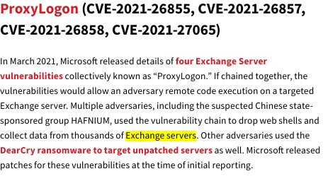
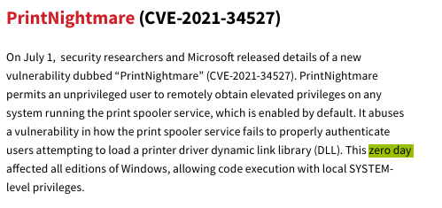
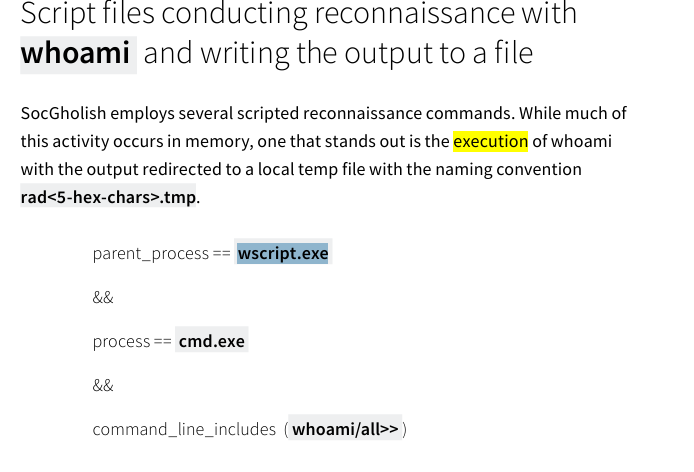
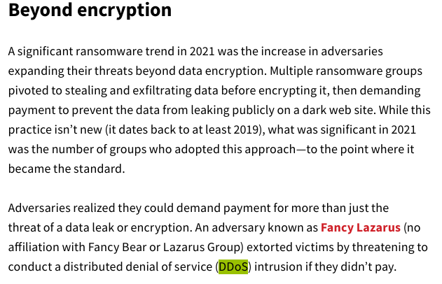

# The Report - Blue Team Labs Online (Write-up)
 
## Scenario
Anda bekerja di SOC (Security Operations Center) yang baru didirikan dan masih membutuhkan banyak pekerjaan untuk menjadikannya pusat operasi yang berfungsi penuh. Sebagai bagian dari pengumpulan intelijen, Anda ditugaskan untuk mempelajari laporan ancaman yang dirilis pada tahun 2022 dan menyarankan beberapa hasil yang bermanfaat bagi SOC Anda.

## Methodology
Setelah file zip diekstrak saya mulai buka file `.pdf` nya via Microsoft Edge

**Pertanyaan (1) Sebutkan serangan rantai pasokan yang terkait dengan pustaka pencatatan Java pada akhir tahun 2021 (Format: AttackNickname)**

At was easy to think the primary recipient was johnsmith123 but I identified a bounce error coming from line 116. This showed the primary 
email the message was intended to be delivered to.

**What is the subject of this email?**

Here, I simply searched for the word subject using the key combination **ctrl+f** which returned the subject of the email.

**Pertanyaan (2) Sebutkan ID Teknik MITRE yang memengaruhi lebih dari 50% pelanggan (Format: TXXXX)**

So from identifying the subject of the email, the **Sent:** tag showed the exact date and time the eail was sent.

**Pertanyaan (3) Sebutkan nama 2 kerentanan yang terkait dengan Exchange Server (Format: VulnNickname, VulnNickname)**

I searched for the **X-Originating-IP** header which is a non-standard email header used to identify the original client IP address of the sender. And there it was..

**Pertanyaan (4) Kirimkan CVE dari kerentanan zero day pada driver yang menyebabkan RCE dan mendapatkan hak akses SYSTEM (Format: CVE-XXXX-XXXXX)**

Now I needed to leave VS Code and go to whois.domaintools.com for OSINT. I waited for a couple of minutes, even tried using my phone but seems likethe website was down.

So I decided to fall back on linux! And there it was..

But then why not go back to VS code, the host might have just been there and I just have to search. And there it was again.. the
X-Authenticated-Sender header huh!

**Pertanyaan (5) Sebutkan 2 kelompok musuh yang memanfaatkan SEO untuk mendapatkan akses awal (Format: Grup1, Grup2)**

The attachment filename was not visible by inspecting the eml file in VS code hence to get the filename, I had to drop the eml file intothunderbird. Hence I downloaded it

So after opening the eml in Thunderbird, I located the filename and
definitely, its extension is .eml.

**Pertanyaan (6) Dalam aturan deteksi, apa yang harus disebutkan sebagai proses induk jika kita mencari eksekusi file js berbahaya? [Petunjuk: Bukan CMD] (Format: ParentProcessName.exe)**

Looking at the latter part of the file within Thunderbird was the URL.

**Pertanyaan (7) Geng ransomware mulai menggunakan model afiliasi untuk mendapatkan akses awal. Sebutkan prekursor yang digunakan oleh afiliasi grup ransomware Conti (Format: Affiliate1, Affiliate2, Affiliate3)**

From the URL found inside the attachment, the hostname is blogspot and I know very well that, that's provided by blogger! Lol I used to share blogs there. The webpage is hosted on blogger.

**Pertanyaan (8) Target utama penambang koin adalah perangkat lunak usang. Sebutkan 2 perangkat lunak usang yang disebutkan dalam laporan (Format: Perangkat Lunak1, Perangkat Lunak2)**

**Pertanyaan (9) Sebutkan nama kelompok ransomware yang mengancam akan melakukan serangan DDoS jika mereka tidak membayar tebusan (Format: NamaGrup)**

**Pertanyaan (10) Apa langkah pengamanan yang perlu kita aktifkan untuk koneksi RDP guna melindungi dari serangan ransomware? (Format: XXX)**

Here, I copy the URL and paste it into URL2PNG which returned, "Blog has
been removed". Lol the answer was hidden in plain sight.

## Results

## Reflection
This was an awesome investigation of email, as a phishing vector. I got to understand other header fields useful in conducting email phishing analysis.
