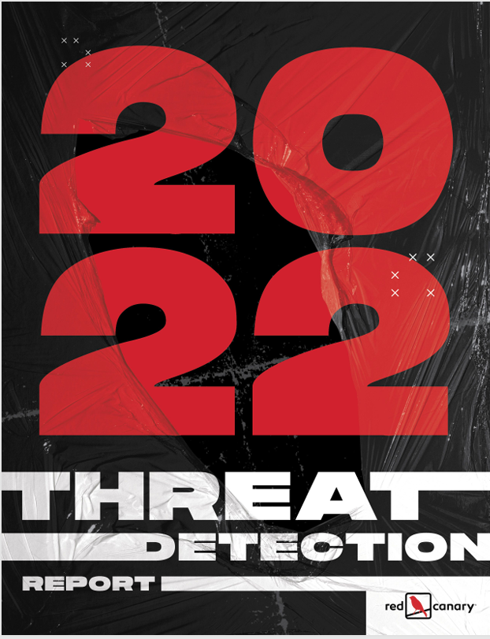
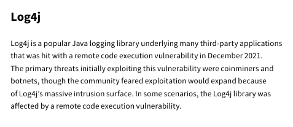
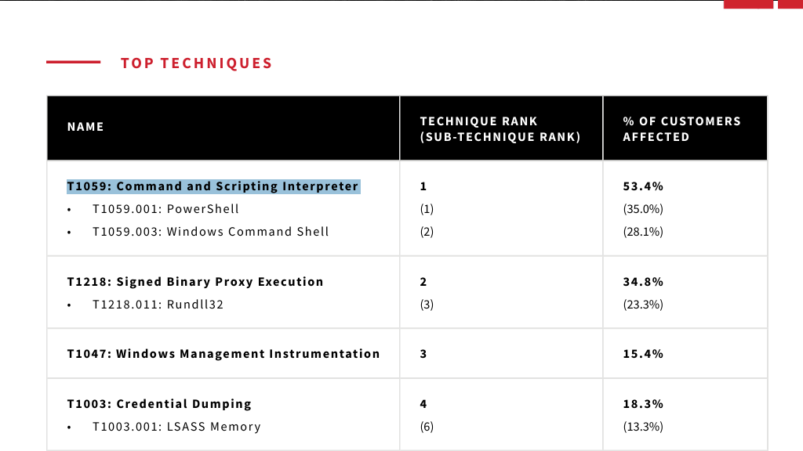
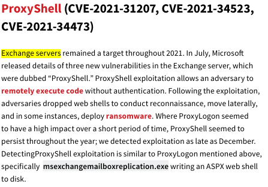
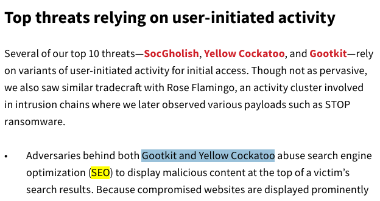
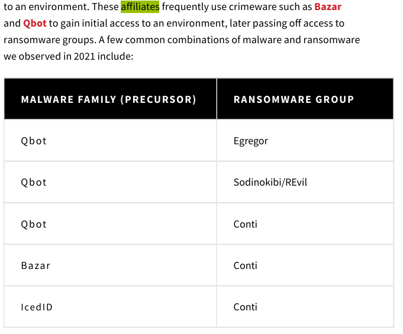
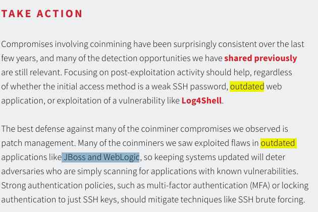
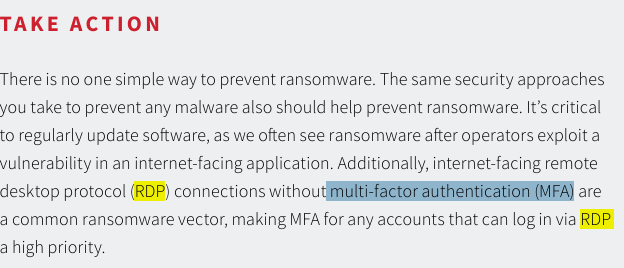

# The Report - Blue Team Labs Online (Write-up)
 
## Scenario
Anda bekerja di SOC (Security Operations Center) yang baru didirikan dan masih membutuhkan banyak pekerjaan untuk menjadikannya pusat operasi yang berfungsi penuh. Sebagai bagian dari pengumpulan intelijen, Anda ditugaskan untuk mempelajari laporan ancaman yang dirilis pada tahun 2022 dan menyarankan beberapa hasil yang bermanfaat bagi SOC Anda.

## Methodology
Setelah file zip diekstrak saya mulai buka file `.pdf` nya via Microsoft Edge. Nah LAB ini fokusnya adalah analis terhadap laporan Threat Detection 2022 oleh Red Canary.

**Pertanyaan (1) Sebutkan serangan rantai pasokan (supply chain) yang terkait dengan pustaka pencatatan Java pada akhir tahun 2021 (Format: AttackNickname)**

Kita bisa membuka bagian supply chain compromise untuk menemukan serangan supply chain yang dimaksud terkait pencacatan java, nah setelah saya membaca beberapa serangan maka saya menumukan serangan yang dimaksud

Jadi maksud soal ini adalah memberitahukan kita serangan-serangan supply chain attack pada laporan Threat Detection yang terdiri dari 4 serangan, namun pada soal ini spesifik menyoroti serangan supply chain pada pustaka pencacatan java

**Pertanyaan (2) Sebutkan ID Teknik MITRE yang memengaruhi lebih dari 50% pelanggan (Format: TXXXX)**

Pada bagian ini kita diarahkan untuk melihat laporan top teknik MITTRE AT&CK yang digunakan, nama teknik dan rank tekniknya serta seberapa besar pengaruhnya ke customer, soal ini spesfik menyoroti teknik MITRE AT&CK yang mempengaruhi lebih daei 50% customer.

**Pertanyaan (3) Sebutkan nama 2 kerentanan yang terkait dengan Exchange Server (Format: VulnNickname, VulnNickname)**

Pada bagian ini kita diminta untuk menganalisis tren kerentanan (Vulnerability) ada tahun 2021 pada platform-platform perusahaan yang populer. Soal ini spesifik meminta kita untuk menganalisis terkait kerentana dengan Exchange Server.

**Pertanyaan (4) Kirimkan CVE dari kerentanan zero day pada driver yang menyebabkan RCE dan mendapatkan hak akses SYSTEM (Format: CVE-XXXX-XXXXX)**

Masih pada bagian tren kerentanan tahun 2021, namun fokus soal ini meminta kita untuk menganalisis kerentanan zeror day pada driver yang menyebabkan RCE dan mendapatkan hak akses SYSTEM fokus pada formatnya

**Pertanyaan (5) Sebutkan 2 kelompok musuh yang memanfaatkan SEO untuk mendapatkan akses awal (Format: Grup1, Grup2)**

Pada bagian kita diminta untuk menganalisis User-initiated initial access yang dimana menurut report tersebut banyak sekali pengguna yang mencari konten yang tanpa mereka sadari bersifat berbahaya. Soal ini spesisfik meminta kita untuk menemukan kelompok jahat yang memanfaatkan SEO untuk mendapatkan akses awal

**Pertanyaan (6) Dalam aturan deteksi, apa yang harus disebutkan sebagai proses induk jika kita mencari eksekusi file js berbahaya? [Petunjuk: Bukan CMD] (Format: ParentProcessName.exe)**

Pada bagian ini kita diminta menganalis bagian Detection opportunities disana kita menemukan yang namanya parentProcessName yang disebut sebagai proses induk jika kita ingin mencari file eksekusi js yang memiliki potensi bahaya

**Pertanyaan (7) Geng ransomware mulai menggunakan model afiliasi untuk mendapatkan akses awal. Sebutkan prekursor yang digunakan oleh afiliasi grup ransomware Conti (Format: Affiliate1, Affiliate2, Affiliate3)**
Pada bagian kita diminta untuk menganalisis bagian The affiliate model pada topik Ransomware spesifik soal ini membahas kelompok atau genk ransomware yang menggunakan model affiliasi untuk mendapatkan akses awal. Bahaya dari kelompok ini biasanya mengandalkan sejumlah afiliasi untuk memberikan akses awal ke suatu lingkungan sebelum mereka mengenkripsi file atau melakukan tindakan lainnya. ada 3 affiliate yang saya temukan di model affiliasi ini sesuai dengan permintaan soal juga

**Pertanyaan (8) Target utama penambang koin adalah perangkat lunak usang. Sebutkan 2 perangkat lunak usang yang disebutkan dalam laporan (Format: Perangkat Lunak1, Perangkat Lunak2)**

Pada bagian ini meminta kita untuk mencari perangkat lunak yang sudah usang yang dimana perangkat lunak usang sebagian besar memiliki masalah kerentanan karena tidak pernah dilakukan pembaruan patch. Kerentanan inilah yang bisa dimanfaatkan oleh penyerang untuk masuk ke sistem kita. ada  2 perangkat lunak usang yang bisa kita temukan pada laporan tersebut

**Pertanyaan (9) Sebutkan nama kelompok ransomware yang mengancam akan melakukan serangan DDoS jika mereka tidak membayar tebusan (Format: NamaGrup)**

Pada bagian ini kita kembali lagi ke topik Ransomware namun fokus kita kali ini pada bagian Beyond encryption. Salah satu tren ransomware yang signifikan pada tahun 2021 adalah meningkatnya jumlah pelaku ancaman yang memperluas cakupan serangan mereka melampaui sekadar enkripsi data. Nah pada soal ini kita diminta untuk menemukan kelompok yang melakukan pengancaman dengan melakukan seranggan DDoS jika tidak membayar tebusan

**Pertanyaan (10) Apa langkah pengamanan yang perlu kita aktifkan untuk koneksi RDP guna melindungi dari serangan ransomware? (Format: XXX)**

Masih pada topik Ransomware namun fokus kita arahkan ke bagian akhir yaitu Take Action salah satunya menjelaskan langkah pengamanan yang perlu diaktifkan koneksi RDP untuk melindungi dari serangan Ransomware

## Ringkasan
Challenge ini berupa analisis laporan Red Canary Threat Detection Report 2022. Hasilnya saya rangkum jadi prioritas deteksi dan mitigasi untuk SOC, lihat bagian [Insight untuk SOC](insight-untuk-soc.md).

## Referensi
- [Lab The Report](https://blueteamlabs.online/home/challenge/the-report-a6dd340dba)
- [Red Canary Threat Detection Report 2022](https://blueteamlabs.online/storage/files/8c4cbf1af327dca7176473fa355e2dc29cfc527b.zip)
